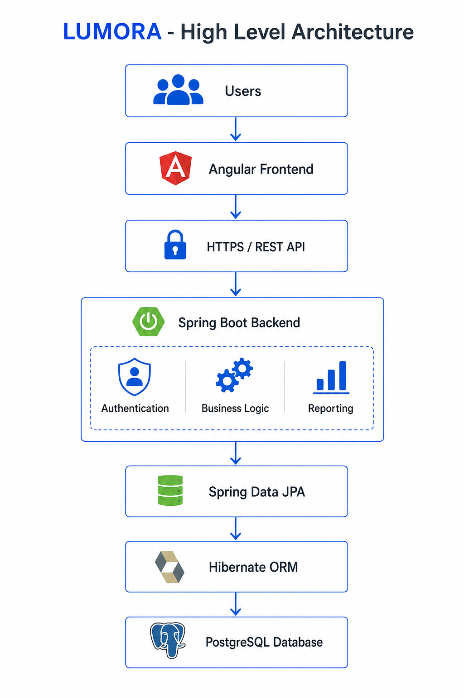
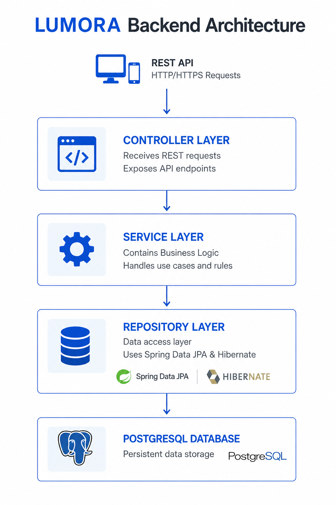

# LUMORA Architecture

## About LUMORA

LUMORA is a multi-tenant SaaS platform designed to help businesses transform operational data into actionable decisions through dashboards, KPIs and AI-powered insights.

The idea for LUMORA was born from my professional experience as a Data Analyst in the retail sector, where I worked extensively with sales, inventory, executive reporting and business intelligence. One recurring challenge was seeing decision-makers depend on multiple reports, spreadsheets and manual processes just to understand what was happening in their business.

That experience inspired a simple question:

> What if executives could access all their business insights from a single platform and even ask questions to an AI assistant?

LUMORA is my attempt to build that solution.

More importantly, LUMORA represents my own professional transition from **Data Analyst** to **Java Software Developer**, allowing me to combine nearly two decades of business experience with modern software engineering practices. Every feature I build is an opportunity to transform real business knowledge into software while continuing to grow as a developer.

---

## High-Level Architecture



### Architecture Flow

```text
                    Users
                      │
                      ▼
              Angular Frontend
                      │
                  HTTPS / REST
                      │
                      ▼
             Spring Boot Backend
                      │
        ┌─────────────┼─────────────┐
        ▼             ▼             ▼
 Authentication   Business Logic   Reporting
        │             │             │
        └─────────────┼─────────────┘
                      │
               Spring Data JPA
                      │
                  Hibernate ORM
                      │
                      ▼
                 PostgreSQL
```

---

## Backend Architecture



### Backend Layers

```text
Controller
    │
    ▼
Service
    │
    ▼
Repository
    │
    ▼
Database
```

### Controller

- Receives HTTP requests
- Validates input
- Returns HTTP responses

### Service

- Implements business rules
- Coordinates application logic
- Calls repositories

### Repository

- Database access
- CRUD operations
- JPA Queries

### Database

- PostgreSQL
- Relational model
- Persistent storage

---

## Frontend

- Angular
- TypeScript
- Responsive Design
- REST API Consumer
- JWT Authentication

---

## Backend

- Java 21
- Spring Boot
- Spring Security
- Spring Data JPA
- Hibernate
- Bean Validation
- OpenAPI / Swagger

---

## Database

- PostgreSQL
- Relational Database
- Normalized Schema

---

## Security

- JWT Authentication
- Role-Based Access Control (RBAC)
- Password Encryption (BCrypt)

---

## API

- REST Architecture
- JSON
- HTTP Status Codes
- OpenAPI Documentation

---

## Multi-Tenant Architecture

Each company has:

- Own users
- Own stores
- Own products
- Own inventory
- Own sales
- Own dashboards
- Own KPIs

Business data is logically isolated.

---

## Future Integrations

- Python Analytics Engine
- Artificial Intelligence Assistant
- Power BI
- SAP Integration
- Microsoft Dynamics
- Oracle ERP
- CSV Import
- Excel Import

---

## Future Infrastructure

- Docker
- Docker Compose
- GitHub Actions
- AWS
- Monitoring
- Logging
- CI/CD Pipeline

---

## Design Principles

- Layered Architecture
- SOLID Principles
- Clean Code
- RESTful APIs
- Separation of Concerns
- Modular Design