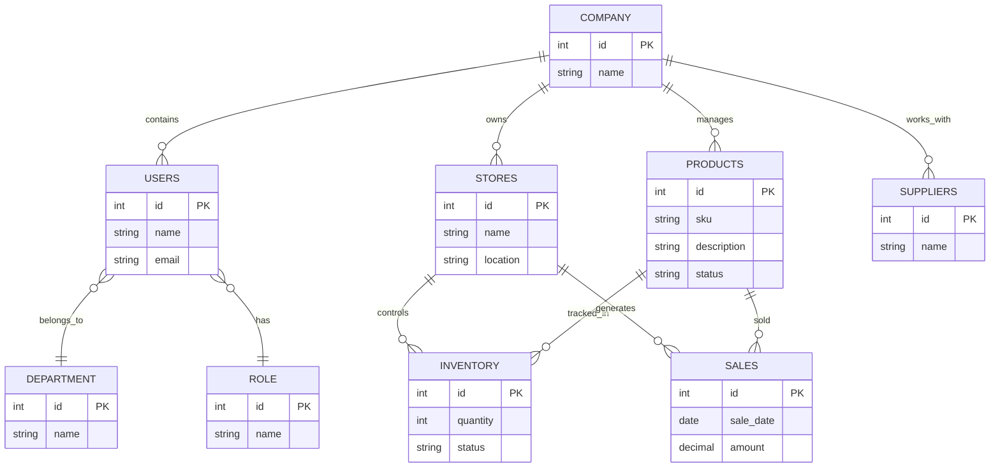

# LUMORAIQ Database Design

## Entity Relationship Diagram

The following diagram represents the main business domains and their relationships.

---

## Domain Overview

The database model follows a multi-tenant SaaS architecture.

Each COMPANY represents an independent business tenant with isolated business data.

Main business domains:

- **Users Management**
    - Employees
    - Departments
    - Roles
    - Access control

- **Store Management**
    - Retail locations
    - Operational structure

- **Product Management**
    - Product catalog
    - Product lifecycle

- **Inventory Management**
    - Stock availability
    - Product tracking by store

- **Procurement Management**
    - Supplier relationships
    - Product sourcing

- **Sales Management**
    - Sales transactions
    - Business analytics data

---

## Future Extensions

The model is designed to support future capabilities:

- Executive dashboards
- KPI analytics
- AI-powered insights
- Automated reports
- ERP integrations
- Advanced inventory forecasting