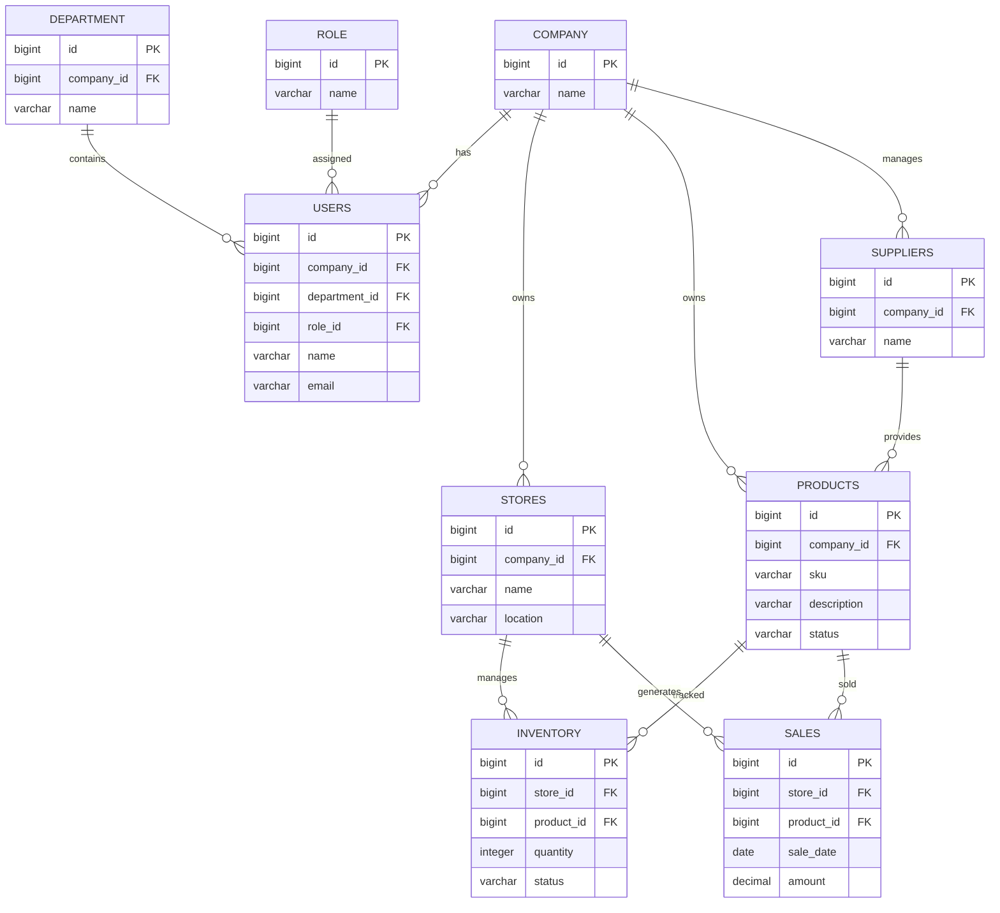

# LUMORAIQ Database Design

## Entity Relationship Diagram

---

## Design Notes

The database model is designed following a multi-tenant SaaS architecture.

Each COMPANY represents an independent business tenant with isolated data.

Main domains:

- **Users Management**: Employees, departments and roles for access control.
- **Stores Management**: Physical retail locations belonging to each company.
- **Product Management**: Central product catalog.
- **Inventory Management**: Stock availability by store and product.
- **Procurement Management**: Supplier relationships and product sourcing.
- **Sales Management**: Transaction data used for analytics and business intelligence.

The model is designed to support future extensions such as:

- Dashboard KPIs
- AI-powered insights
- Data analytics
- Automated reports
- External ERP integrations