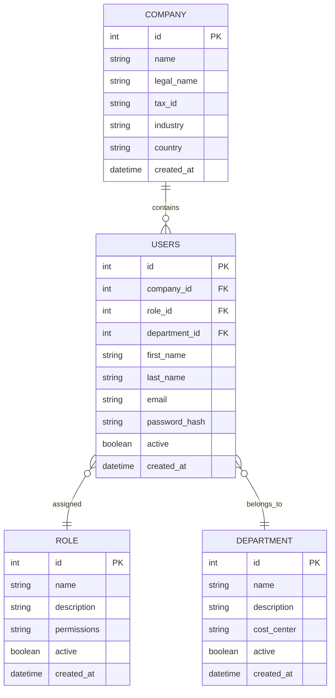
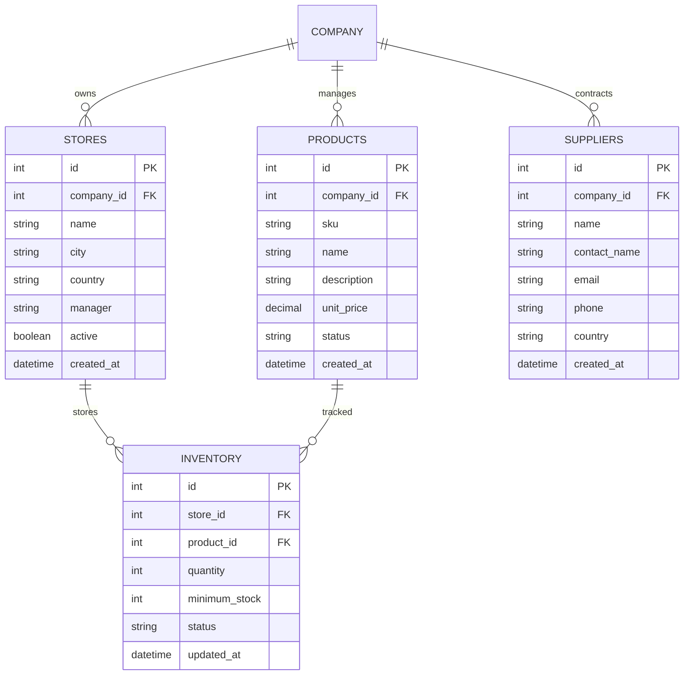
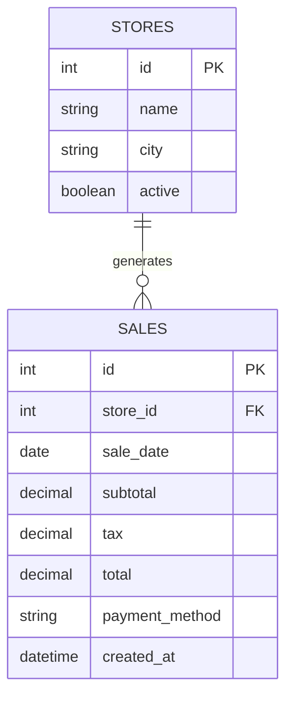

# Database Design

## Overview

LUMORA follows a **domain-driven database design**.

Instead of documenting the entire database as a single Entity Relationship Diagram (ERD), the data model is organized into business domains. This approach improves readability, maintainability and scalability while reflecting how enterprise SaaS applications are typically documented.

---

# Identity Domain

Responsible for user management, authentication and organizational structure.

---

# Operations Domain

Responsible for retail operations including stores, products, suppliers and inventory.

---

# Sales Domain

Responsible for sales transactions and business reporting.

---

# Domain Summary

## Identity

Manages users and organizational structure.

- Company
- Users
- Roles
- Departments

---

## Operations

Represents the operational side of the business.

- Stores
- Products
- Inventory
- Suppliers

---

## Sales

Stores transactional information used for reporting and analytics.

- Sales
- Revenue
- Executive KPIs

---

# Future Database Extensions

The MVP intentionally keeps the schema simple.

Future releases may introduce:

## Customer Management

- CUSTOMERS

## Sales

- SALE_ITEMS
- PAYMENTS
- RETURNS

## Procurement

- PURCHASE_ORDERS
- PURCHASE_ITEMS

## Inventory

- WAREHOUSES
- INVENTORY_MOVEMENTS
- STOCK_ADJUSTMENTS

## Product Catalog

- CATEGORIES
- BRANDS

## Analytics

- KPI_SNAPSHOTS
- AI_RECOMMENDATIONS
- FORECASTS

## Security

- AUDIT_LOGS
- USER_SESSIONS

---

# Design Principles

The database has been designed following enterprise software best practices.

- Multi-tenant architecture
- Domain-driven organization
- Normalized relational model (3NF)
- PostgreSQL compatible
- Spring Data JPA ready
- Scalable for SaaS environments
- Designed for future AI and analytics capabilities